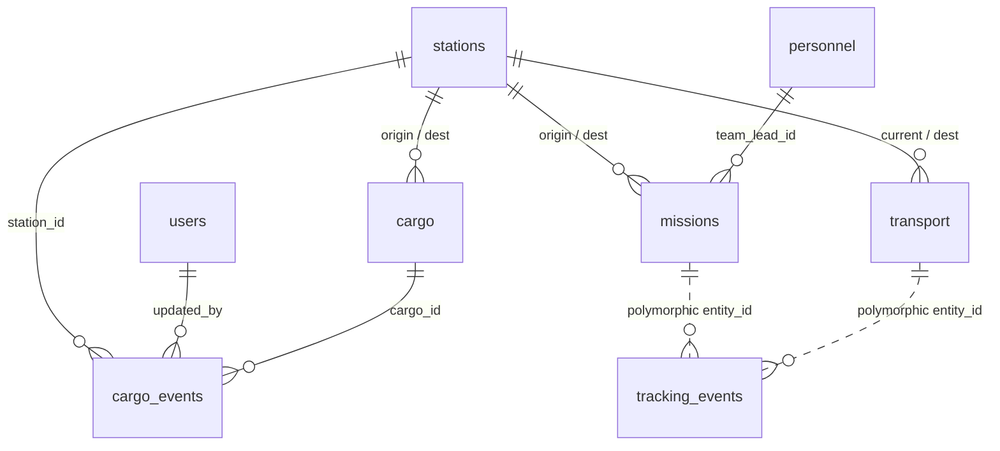

# DHRUV — Member 2 Logistics & Tracking Handover Documentation

**Author**: Member 2 — Backend Logistics & Tracking Engineer  
**Branch**: `feature/logistics`  
**Database**: PostgreSQL 16 (`dhruv_db`), Zero SQLite Fallback  
**Test Suite**: 52/52 automated tests passing (16 Member 1 + 36 Member 2)  
**Target Audience**: Member 3 (Intelligence & Safety Engineer), Frontend Engineers, Hackathon Evaluators

---

## 1. Domain Overview & Responsibilities

Member 2 owns the logistics, transport fleet, traverse mission operations, QR chain of custody, real-time GPS telemetry ingestion, and telemetry simulation for the DHRUV polar platform.



---

## 2. Implemented Database Schema & Models

### A. `cargo`
Stores cargo manifests and polar supply packages.
* `id` (`INTEGER`, PK)
* `cargo_code` (`VARCHAR`, UNIQUE, Indexed, format: `CRG-2026-XXX`)
* `name` (`VARCHAR`, NOT NULL)
* `category` (`VARCHAR`, Enum: `SCIENTIFIC`, `MEDICAL`, `FUEL`, `FOOD`, `EQUIPMENT`)
* `weight` (`FLOAT`, NOT NULL, kg > 0)
* `priority` (`VARCHAR`, Enum: `LOW`, `MEDIUM`, `HIGH`, `CRITICAL`)
* `origin_station_id` (`INTEGER`, FK -> `stations.id` ON DELETE RESTRICT)
* `destination_station_id` (`INTEGER`, FK -> `stations.id` ON DELETE RESTRICT)
* `status` (`VARCHAR`, Enum: `PLANNED`, `PACKED`, `DISPATCHED`, `IN_TRANSIT`, `DELAYED`, `ARRIVED`, `DELIVERED`)
* `current_location` (`VARCHAR`, NOT NULL)
* `qr_code` (`VARCHAR`, UNIQUE, Indexed, format: `DHRUV:CARGO:CRG-2026-XXX`)
* `created_at` (`TIMESTAMP WITH TIME ZONE`)

### B. `cargo_events`
Immutable chain-of-custody log generated each time a package QR is scanned or handled.
* `id` (`INTEGER`, PK)
* `cargo_id` (`INTEGER`, FK -> `cargo.id` ON DELETE CASCADE, Indexed)
* `event_type` (`VARCHAR`, Enum: `PACKED`, `SCANNED`, `LOADED`, `UNLOADED`, `ARRIVED_AT_HUB`, `DELAY_REPORTED`, `DELIVERED`)
* `location` (`VARCHAR`, NOT NULL)
* `station_id` (`INTEGER`, FK -> `stations.id` ON DELETE SET NULL, Indexed, Nullable)
* `latitude` (`FLOAT`, Nullable)
* `longitude` (`FLOAT`, Nullable)
* `timestamp` (`TIMESTAMP WITH TIME ZONE`, default `now()`)
* `remarks` (`VARCHAR`, Nullable)
* `updated_by` (`INTEGER`, FK -> `users.id` ON DELETE SET NULL, Nullable)

### C. `transport`
Vehicles, aircraft, helicopters, and research vessels in the polar fleet.
* `id` (`INTEGER`, PK)
* `transport_name` (`VARCHAR`, UNIQUE, Indexed, NOT NULL)
* `type` (`VARCHAR`, Enum: `RESEARCH_VESSEL`, `CARGO_AIRCRAFT`, `SNOW_VEHICLE`, `HELICOPTER`)
* `capacity` (`FLOAT`, NOT NULL, kg > 0)
* `status` (`VARCHAR`, Enum: `AVAILABLE`, `IN_TRANSIT`, `MAINTENANCE`, `STANDBY`)
* `current_location` (`VARCHAR`, NOT NULL)
* `destination` (`VARCHAR`, NOT NULL)
* `eta` (`TIMESTAMP WITH TIME ZONE`, Nullable)
* `current_station_id` (`INTEGER`, FK -> `stations.id` ON DELETE SET NULL, Nullable)
* `destination_station_id` (`INTEGER`, FK -> `stations.id` ON DELETE SET NULL, Nullable)
* `created_at` (`TIMESTAMP WITH TIME ZONE`)

### D. `missions`
Field science traverses, reconnaissance expeditions, and resupply convoys.
* `id` (`INTEGER`, PK)
* `mission_name` (`VARCHAR`, UNIQUE, Indexed, NOT NULL)
* `mission_type` (`VARCHAR`, Enum: `SCIENTIFIC_SURVEY`, `LOGISTICS_RESUPPLY`, `RECONNAISSANCE`, `EMERGENCY_RESCUE`)
* `origin` (`VARCHAR`, NOT NULL)
* `destination` (`VARCHAR`, NOT NULL)
* `team_lead_id` (`INTEGER`, FK -> `personnel.id` ON DELETE RESTRICT, Indexed)
* `origin_station_id` (`INTEGER`, FK -> `stations.id` ON DELETE SET NULL, Nullable)
* `destination_station_id` (`INTEGER`, FK -> `stations.id` ON DELETE SET NULL, Nullable)
* `start_time` (`TIMESTAMP WITH TIME ZONE`, NOT NULL)
* `expected_return` (`TIMESTAMP WITH TIME ZONE`, NOT NULL)
* `status` (`VARCHAR`, Enum: `PLANNED`, `ACTIVE`, `COMPLETED`, `DELAYED`, `CANCELLED`, `EMERGENCY`)
* `risk_level` (`VARCHAR`, Enum: `LOW`, `MEDIUM`, `HIGH`, `CRITICAL`)
* `created_at` (`TIMESTAMP WITH TIME ZONE`)

### E. `tracking_events`
High-frequency GPS and battery telemetry stream for field entities.
* `id` (`INTEGER`, PK)
* `entity_type` (`VARCHAR`, Enum: `MISSION`, `TRANSPORT`, Indexed)
* `entity_id` (`INTEGER`, NOT NULL, Indexed)
* `latitude` (`FLOAT`, NOT NULL, `-90.0` to `90.0`)
* `longitude` (`FLOAT`, NOT NULL, `-180.0` to `180.0`)
* `speed` (`FLOAT`, NOT NULL, km/h `>= 0`)
* `battery` (`FLOAT`, NOT NULL, `0.0` to `100.0`%)
* `timestamp` (`TIMESTAMP WITH TIME ZONE`, default `now()`, Indexed)
* Composite index: `ix_tracking_events_entity` on `(entity_type, entity_id)`

---

## 3. Complete API Endpoint Catalog

All routes conform strictly to the `{id}` parameter convention and bearer JWT authentication.

### Cargo & Chain of Custody (`/cargo`)
| Method | Path | RBAC Roles | Description |
| :--- | :--- | :--- | :--- |
| `GET` | `/cargo` | All authenticated | List cargo with query filters (`status`, `priority`, `category`, `origin_station_id`, `destination_station_id`). |
| `POST` | `/cargo` | `ADMIN`, `OPERATIONS`, `LOGISTICS` | Create package (auto-generates sequential `cargo_code` & `qr_code`). |
| `GET` | `/cargo/{id}` | All authenticated | Get package details. |
| `PUT` | `/cargo/{id}` | `ADMIN`, `OPERATIONS`, `LOGISTICS` | Update package details. |
| `PATCH` | `/cargo/{id}/status` | `ADMIN`, `OPERATIONS`, `LOGISTICS`, `FIELD_TEAM` | Advance lifecycle status with state machine validation. |
| `POST` | `/cargo/{id}/scan` | `ADMIN`, `OPERATIONS`, `LOGISTICS`, `FIELD_TEAM` | Scan QR payload, log `CargoEvent`, update location & transition status. |
| `GET` | `/cargo/{id}/timeline` | All authenticated | Fetch chronological chain-of-custody audit log. |

### Transport Fleet (`/transport`)
| Method | Path | RBAC Roles | Description |
| :--- | :--- | :--- | :--- |
| `GET` | `/transport` | All authenticated | List transports (filters: `status`, `type`). |
| `POST` | `/transport` | `ADMIN`, `OPERATIONS`, `LOGISTICS` | Register new transport vessel or vehicle. |
| `GET` | `/transport/{id}` | All authenticated | Get transport details by ID. |
| `PUT` | `/transport/{id}` | `ADMIN`, `OPERATIONS`, `LOGISTICS` | Update transport parameters. |
| `GET` | `/transport/{id}/status` | All authenticated | Fast operational status endpoint. |

### Traverse Missions (`/missions`)
| Method | Path | RBAC Roles | Description |
| :--- | :--- | :--- | :--- |
| `GET` | `/missions` | All authenticated | List missions (filters: `status`, `mission_type`, `risk_level`). |
| `POST` | `/missions` | `ADMIN`, `OPERATIONS` | Schedule expedition mission with personnel team lead. |
| `GET` | `/missions/{id}` | All authenticated | Get mission details by ID. |
| `PUT` | `/missions/{id}` | `ADMIN`, `OPERATIONS` | Update mission details. |
| `PATCH` | `/missions/{id}/status` | `ADMIN`, `OPERATIONS`, `FIELD_TEAM` | Update status and risk level with lifecycle rules. |

### GPS Telemetry & Live Tracking (`/tracking`)
| Method | Path | RBAC Roles | Description |
| :--- | :--- | :--- | :--- |
| `POST` | `/tracking/update` | `ADMIN`, `OPERATIONS`, `LOGISTICS`, `FIELD_TEAM` | Ingest telemetry point (validates bounds and entity existence). |
| `GET` | `/tracking/live` | All authenticated | Aggregates and returns the latest live coordinate, speed, and battery for all entities. |
| `GET` | `/tracking/{entity_type}/{entity_id}` | All authenticated | Chronological historical coordinate breadcrumb trail. |

---

## 4. Integration Blueprint for Member 3 (Intelligence & Safety)

Member 3 can directly plug into Member 2 tables and endpoints to build predictive intelligence:

### 1. Signal-Loss Anomaly Detection (`SIGNAL_LOST`)
* **Data Source**: Poll `GET /tracking/live` or query `tracking_events` directly.
* **Algorithm**:
  ```python
  time_gap_seconds = (now - latest_timestamp).total_seconds()
  if time_gap_seconds > 900:  # 15 minutes threshold
      create_alert(title="Signal Lost", severity="HIGH", entity_type=entity_type, entity_id=entity_id)
  ```
* **Demo Helper**: Run the simulator with `--anomaly-stop`.

### 2. Low Battery Anomaly Detection (`LOW_BATTERY`)
* **Data Source**: `GET /tracking/live`.
* **Algorithm**:
  ```python
  if latest_battery < 20.0:
      create_alert(title="Low Battery Warning", severity="WARNING", ...)
  ```

### 3. Cargo Delay Prediction Engine
* **Data Source**: `GET /cargo?status=IN_TRANSIT` and `GET /cargo/{id}/timeline`.
* **Algorithm Inputs**:
  - `status == DELAYED` or scan gap elapsed between stations.
  - Cargo `priority` (`CRITICAL`, `HIGH`).
  - Remaining distance from current `transport.current_location` to `destination_station`.

### 4. Overdue Personnel & Traverses (`PERSONNEL_OVERDUE`)
* **Data Source**: `GET /missions?status=ACTIVE`.
* **Algorithm**:
  ```python
  if now > mission.expected_return:
      create_alert(title="Mission Overdue", severity="CRITICAL", ...)
  ```

### 5. Emergency Response Rescue Optimization Engine
* **Data Source**: `GET /transport?status=AVAILABLE` and `GET /personnel?status=ACTIVE`.
* **Algorithm**:
  - Filter available `SNOW_VEHICLE` or `HELICOPTER`.
  - Calculate Haversine distance between vehicle's `current_location` and SOS incident coordinates.
  - Match nearest medical officer (`MEDICAL` team) for the rescue team recommendation.

---

## 5. Telemetry Simulator Execution Guide

The simulator is located at [`backend/scripts/simulate_tracking.py`](file:///e:/DHRUV/backend/scripts/simulate_tracking.py).

### Standard Simulation Run:
```bash
python backend/scripts/simulate_tracking.py --base-url http://localhost:8000 --entity-type MISSION --entity-id 1 --points 15 --interval 2.0
```

### Anomaly Demo Run (Signal Loss Simulation):
```bash
python backend/scripts/simulate_tracking.py --base-url http://localhost:8000 --entity-type MISSION --entity-id 1 --points 10 --anomaly-stop
```
*(Stops telemetry abruptly at ping 5, allowing Member 3 to demonstrate `SIGNAL_LOST` alerting).*

---

## 6. How to Run the Automated Test Suite

Run all 52 tests:
```powershell
$env:PYTHONPATH = "backend"
e:\DHRUV\venv\Scripts\pytest.exe -v backend/tests
```
All 52 tests pass in < 5 seconds.
