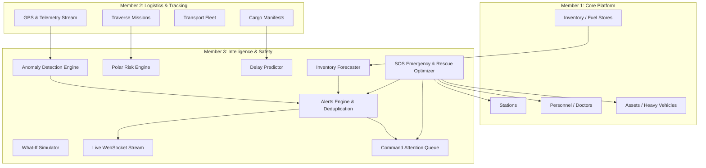

# DHRUV — Member 3 Alerts, Emergency, Risk & Intelligence Handover Documentation

**Author**: Member 3 — Alerts, Emergency, Risk & Intelligence Engineer  
**Branch**: `feature/alerts-risk`  
**Database**: PostgreSQL 16 (`dhruv_db`), Zero SQLite Fallback  
**Test Suite**: 73/73 automated tests passing across full platform (16 Member 1 + 36 Member 2 + 21 Member 3)  
**Target Audience**: Operations Command, Field Leads, Frontend Engineers, Hackathon Evaluators

---

## 1. Domain Overview & Responsibilities

Member 3 completes the mission-critical safety, emergency response, autonomous intelligence, and real-time situational awareness layer for Project DHRUV.



---

## 2. Implemented Database Schema & Models

### A. `alerts`
Central notification and operational warning table with deduplication and state lifecycle.
* `id` (`INTEGER`, PK)
* `alert_type` (`VARCHAR`, Enum: `ANOMALY`, `WEATHER`, `SYSTEM`, `EMERGENCY`, `INVENTORY_SHORTAGE`, `TRAVERSE_RISK`, `COMMUNICATION_LOST`)
* `severity` (`VARCHAR`, Enum: `LOW`, `MEDIUM`, `HIGH`, `CRITICAL`, Indexed)
* `title` (`VARCHAR`, NOT NULL)
* `message` (`VARCHAR`, NOT NULL)
* `entity_type` (`VARCHAR`, Enum: `MISSION`, `CARGO`, `TRANSPORT`, `STATION`, `INVENTORY`, `ASSET`, `PERSONNEL`, `SYSTEM`)
* `entity_id` (`INTEGER`, Nullable, Indexed)
* `station_id` (`INTEGER`, FK -> `stations.id` ON DELETE SET NULL, Nullable, Indexed)
* `status` (`VARCHAR`, Enum: `ACTIVE`, `ACKNOWLEDGED`, `RESOLVED`, `DISMISSED`, Indexed, default `ACTIVE`)
* `acknowledged_by` (`INTEGER`, FK -> `users.id` ON DELETE SET NULL, Nullable)
* `acknowledged_at` (`TIMESTAMP WITH TIME ZONE`, Nullable)
* `resolved_by` (`INTEGER`, FK -> `users.id` ON DELETE SET NULL, Nullable)
* `resolved_at` (`TIMESTAMP WITH TIME ZONE`, Nullable)
* `resolution_notes` (`VARCHAR`, Nullable)
* `created_at` (`TIMESTAMP WITH TIME ZONE`, default `now()`)

### B. `emergencies`
High-priority life safety and polar rescue incident management table.
* `id` (`INTEGER`, PK)
* `incident_code` (`VARCHAR`, UNIQUE, Indexed, format: `EMG-2026-XXXX`)
* `title` (`VARCHAR`, NOT NULL)
* `emergency_type` (`VARCHAR`, Enum: `MEDICAL`, `CREVASSE_FALL`, `BLIZZARD_STRANDED`, `FIRE`, `POWER_FAILURE`, `GENERATOR_FAILURE`, `VEHICLE_BREAKDOWN`, `COMM_LOSS`, `EVACUATION`)
* `severity` (`VARCHAR`, Enum: `LOW`, `MEDIUM`, `HIGH`, `CRITICAL`, default `CRITICAL`)
* `description` (`VARCHAR`, NOT NULL)
* `station_id` (`INTEGER`, FK -> `stations.id` ON DELETE SET NULL, Nullable, Indexed)
* `mission_id` (`INTEGER`, FK -> `missions.id` ON DELETE SET NULL, Nullable, Indexed)
* `latitude` (`FLOAT`, Nullable)
* `longitude` (`FLOAT`, Nullable)
* `location_description` (`VARCHAR`, Nullable)
* `status` (`VARCHAR`, Enum: `OPEN`, `DISPATCHED`, `CONTAINED`, `RESOLVED`, `CANCELLED`, Indexed, default `OPEN`)
* `recommended_response` (`VARCHAR`, NOT NULL) — Autogenerated AI dispatch plan
* `rescue_plan` (`VARCHAR`, Nullable)
* `human_decision` (`VARCHAR`, Enum: `PENDING`, `APPROVED`, `REJECTED`, `MODIFIED`, default `PENDING`)
* `decision_notes` (`VARCHAR`, Nullable)
* `decision_timestamp` (`TIMESTAMP WITH TIME ZONE`, Nullable)
* `reported_by` (`INTEGER`, FK -> `users.id` ON DELETE SET NULL, Nullable)
* `created_at` (`TIMESTAMP WITH TIME ZONE`, default `now()`)
* `resolved_at` (`TIMESTAMP WITH TIME ZONE`, Nullable)

---

## 3. Intelligence Engines & Algorithmic Design

Project DHRUV utilizes transparent, deterministic mathematical and heuristic intelligence engines optimized for high-reliability polar operations:

### 1. Mission Risk Scoring Engine (`backend/app/ai/risk_engine.py`)
- **Scale**: Normalized score from `0.0` to `100.0`.
- **Classification**: `LOW` (<30), `MEDIUM` (30-59), `HIGH` (60-79), `CRITICAL` (>=80).
- **Factors Analyzed**:
  - Distance between stations or traverse duration (hours).
  - High-latitude winter season risk multiplier (Antarctic polar night: May to August).
  - Active anomaly penalty (+20 per active alert on mission or assigned transport).
  - Low battery / telemetry degradation penalty (+25 if battery <25%).
  - Transport health / maintenance state.
- **Output**: Detailed list of drivers explaining the score and actionable polar mitigation recommendations.

### 2. Cargo Delay Prediction Engine (`backend/app/ai/delay_prediction.py`)
- **Output**: `delay_probability` ($[0.0, 1.0]$) and `estimated_delay_hours` ($\ge 0$).
- **Factors Analyzed**:
  - Cargo priority (`CRITICAL` resupply prioritized vs `LOW`).
  - Transport category reliability (Helicopters & Aircraft grounded during low-visibility blizzards; Vessels impacted by pack ice).
  - Historical cargo events (scans indicating prior hold-ups or bottlenecks).

### 3. Telemetry Anomaly Detector (`backend/app/ai/anomaly_detection.py`)
- **Signal Loss**: Detects entities silent for $> 15$ minutes without telemetry.
- **Low Battery**: Flags field entities with telemetry battery $< 20.0\%$.
- **Position & Speed Jumps**: Flags speed exceedances ($> 120$ km/h for polar vehicles) or invalid coordinates.
- **Auto Alert Ingestion**: Automatically calls `AlertService.create_alert()` to notify operators immediately.

### 4. Inventory Stockout Forecaster (`backend/app/ai/inventory_forecast.py`)
- **Equation**: $\text{Days Remaining} = \frac{\text{Current Quantity}}{\text{Daily Consumption}}$
- **Trigger**: Generates `INVENTORY_SHORTAGE` alert whenever $\text{Days Remaining} \le 14$ days or Current Quantity $\le$ Minimum Safety Threshold.

### 5. What-If Scenario Simulator (`backend/app/ai/what_if.py`)
Allows polar commanders to test contingency situations:
- Cargo vessel arrival delays (+X days).
- Air-bridge grounding (aircraft cancelled due to blizzard).
- Generator/heating fuel burn spikes (+X%).
- Computes new days-of-supply remaining for Bharati and Maitri stations and composite operational risk score.

### 6. Situational Attention Queue (`backend/app/services/intelligence_service.py`)
Aggregates all open issues across the expedition into a single prioritized command queue:
- Critical and high-severity unacknowledged alerts.
- Unresolved SOS emergency incidents.
- High-risk missions in progress.
- Impending supply stockouts.
- Provides one-click action labels and target URLs for frontend UI operators.

---

## 4. WebSocket Live Streaming (`/ws`)

FastAPI WebSocket endpoints with connection pooling and broadcast distribution:
* **`/ws/alerts`**: Push notification broadcast channel on alert creation, severity upgrade, acknowledgement, or resolution.
* **`/ws/tracking`**: Real-time telemetry broadcast channel streaming coordinates, speed, and battery metrics.
* **Heartbeat**: Supports text `ping` $\to$ `pong` protocol for connection keepalive.

---

## 5. API Endpoints Reference

### Alerts Module (`/alerts`)
| Method | Path | Auth | Description |
|---|---|---|---|
| `GET` | `/alerts` | Authenticated | List alerts with filters (`status`, `severity`, `entity_type`, `station_id`) |
| `POST` | `/alerts` | Operations/Admin | Create an alert (with automatic deduplication) |
| `GET` | `/alerts/active` | Authenticated | Get all active and unacknowledged alerts |
| `GET` | `/alerts/{id}` | Authenticated | Get specific alert details |
| `PATCH` | `/alerts/{id}/acknowledge` | Authenticated | Acknowledge alert |
| `PATCH` | `/alerts/{id}/resolve` | Authenticated | Resolve alert with optional notes |
| `PATCH` | `/alerts/{id}/dismiss` | Authenticated | Dismiss non-critical alert |

### Emergency Module (`/emergency`)
| Method | Path | Auth | Description |
|---|---|---|---|
| `GET` | `/emergency` | Authenticated | List all reported emergencies |
| `POST` | `/emergency` | Authenticated | Declare SOS emergency (auto generates code & rescue plan) |
| `GET` | `/emergency/active` | Authenticated | Get current highest priority open emergency |
| `GET` | `/emergency/{id}` | Authenticated | Get emergency details |
| `PUT` | `/emergency/{id}` | Operations/Admin | Update emergency status and resolution |
| `POST` | `/emergency/{id}/decision` | Operations/Admin | Human-in-the-loop approval and dispatch command |

### Intelligence Module (`/intelligence`)
| Method | Path | Auth | Description |
|---|---|---|---|
| `GET` | `/intelligence/risk/mission/{id}` | Authenticated | Calculate real-time risk score for a traverse mission |
| `GET` | `/intelligence/delay/cargo/{id}` | Authenticated | Calculate predicted delay probability and hours for cargo |
| `POST` | `/intelligence/anomalies/scan` | Operations/Admin | Scan all active telemetry for anomalies and trigger alerts |
| `GET` | `/intelligence/forecast/inventory` | Authenticated | Calculate stockout projections across all stations |
| `POST` | `/intelligence/what-if` | Authenticated | Run what-if scenario simulations |
| `GET` | `/intelligence/attention` | Authenticated | Fetch prioritized operational attention items |

### WebSocket Module (`/ws`)
| Protocol | Path | Description |
|---|---|---|
| `WS` | `/ws/alerts` | Live alert streaming channel |
| `WS` | `/ws/tracking` | Live GPS and telemetry tracking channel |

---

## 6. Multi-Member Integration & Cross-Cutting Architecture

1. **Member 1 (Base Platform)** $\leftrightarrow$ **Member 3 (Intelligence & Emergency)**:
   - When an emergency is declared, `EmergencyService.calculate_rescue_plan` queries Member 1 `personnel` to find available Doctors and `assets` to locate operational Vehicles with high health scores.
   - When inventory drops below safety threshold, `InventoryForecastService` alerts station commanders.
2. **Member 2 (Logistics & Tracking)** $\leftrightarrow$ **Member 3 (Risk & Anomaly)**:
   - `AnomalyDetector` processes Member 2 `tracking_events` to immediately detect silent transmitters, failing vehicle batteries, and high-speed anomalies.
   - `RiskEngine` calculates risk for Member 2 `missions` based on terrain, route distance, and transport capabilities.
3. **Database Integrity**:
   - Zero SQLite fallback. Strictly PostgreSQL 16 on `dhruv_db`.
   - All foreign keys correctly configured with appropriate `ON DELETE` cascading or nullification.

---

## 7. Verification & Automated Test Suite

The complete backend verification suite passes with 100% success rate:
```powershell
$env:PYTHONPATH="backend"
pytest -q
# 73 passed in 15.67s
```

* **Member 1 Tests**: `test_auth.py`, `test_stations.py`, `test_personnel.py`, `test_inventory.py`, `test_assets.py` (16 passed)
* **Member 2 Tests**: `test_cargo.py`, `test_cargo_events.py`, `test_transport.py`, `test_missions.py`, `test_tracking.py` (36 passed)
* **Member 3 Tests**:
  - `test_alerts.py` (5 tests)
  - `test_emergency.py` (4 tests)
  - `test_risk_and_delay.py` (4 tests)
  - `test_anomalies_and_forecast.py` (4 tests)
  - `test_websocket.py` (3 tests)
  - `test_member3_integration.py` (1 comprehensive end-to-end integration test)
* **Total**: **73 passed, 0 failures**.
